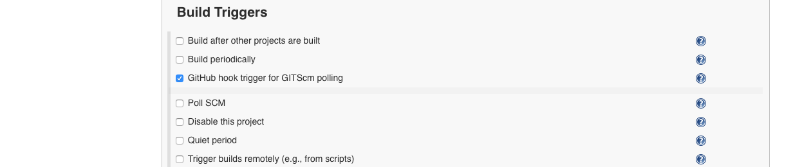

# IBM Client Developer Advocacy App Modernization Series

### Lab - Creating a Jenkins CI/CD Pipeline for deployment to the IBM Cloud Foundry platform

## Overview

In this lab you will  be connecting your Git repository with the Spring Boot sample app Pet Clinic to a Continuous Integration/Continuous Deployment pipeline built with Jenkins that will deploy to the IBM Cloud Foundry platform.

## Setup

If you haven't already:

1. Complete the lab *Using the Cloud Foundry CLI*  by following the instructions [here](../lab2/README.md)

### Step 1: Fork the Github repo that contains the Spring Pet Clinic code

1. Login in [your Github account](https://github.com)

2. In the search bar at the top left type in `spring-petclinic-cf-postgresql`

    

3. Select the repository `IBMAppModernization/spring-petclinic-cf-postgresql` in the search results and then click on the **Fork** icon

    

4. After the fork completes, get the URL for your repository by clicking on the **Clone** button and copying the URL

5. Go to the folder where you initially cloned the Spring Pet Clinic app and enter the following commands. (**Note:** This is necesssary so that the changes you made to a local copy of the app in a previous lab are not lost).
```
   git remote add myfork <your-git-repo-url>
   git add src/main/resources/application-postgresql.properties manifest.yml
   git commit -m "updates from cli lab"
   git push --force myfork master
```


###  Step 2: Get an api key for use by the Jenkins CI/CD Pipeline

The api key will allow a Jenkins job to log into to your Cloud Foundry account and perform action on your behalf. The key can be revoked at any time if you no longer need it.

1. Log into your IBM Cloud account [https://cloud.ibm.com](https://cloud.ibm.com)

2. Select **Manage->Access (IAM)**


3. Click on **IBM Cloud API keys** and then on **Create an IBM Cloud API key**


4. Give the key a name  and click **Create**

5. Click **Download** to download the key as a file (*apiKey.json*)


6. Open the downloaded file with a text editor, you'll need to copy API Key value in the next section.


###  Step 3: Set up the CI/CD pipeline

In this section we will be connecting our cloned Git repo of [this app](https://github.com/IBMAppModernization/spring-petclinic-cf-postgresql)  to set up a Continuous Integration/Continuous Deployment pipeline built with Jenkins. This pipeline contains 4 main  steps as follows:

  | Stage                         | Purpose                                                                        |
  | ----------------------------- | ------------------------------------------------------------------------------ |
  | Build Application jar File    | Pulls in dependencies from Maven and packages application into .jar file       |
  | Deploy to CF with new name and new route  | Pushes new build to CF                                 |
  | System Integration Testing | Placeholder for actual System Integration testing             |
  | Blue/Green Deployment     | Zero downtime replacement of previous version  with new version of app |

More details of this pipeline can be found in the [Jenkinsfile](https://raw.githubusercontent.com/IBMAppModernization/spring-petclinic-cf-postgresql/master/Jenkinsfile).

1. Log into Jenkins using the URL provided to you by your instructor with the credentials provided to you

2. The pipeline should have already been created for you.


3. Click on your pipeline to open it and then click on the **Configure** link in the navigation area at the left to change it's properties

4. Scroll down to the **Build Trigger** section and select **GitHub hook trigger for GIT SCM polling**



5. Scroll down to the **Pipeline** section and find the **Definition** drop down menu. Select **Pipeline script from SCM** and for **SCM** select **Git**.

6. For **Repository URL** enter the url to the cloned repository that you forked earlier (i.e. `https://github.com/[your username]/spring-petclinic-cf-postgresql.git`)

7. Make sure the **Script Path** is set to `Jenkinsfile`


8. Scroll up the the parameters section and enter the appropriate value as the **Default Value** for the following parameters: (**Note:** Ask your instructor if you're unclear about what any of these values should be)

| Parameter                       | Description                                                                  |
| ----------------------------- | ------------------------------------------------------------------------------ |
| APP_NAME   | Name of your deployed Pet Clinic app       |
| DB_SERVICE_NAME | PostgreSQL alias your Pet Clinic app is bound to                                |
| ORGANIZATION  | Your IBM Cloud Foundry organization           |
| SPACE   | Your IBM Cloud Foundry space |
| API_KEY | The api key you created in the previous section |

9. Click **Save**.

### Step 4: Manually trigger a build to test pipeline

1. In Jenkins in the navigation area on the left click on **Build with Parameters**.

2. Verify that all the  parameter values are pre-filled  and then  click on **Build**

3. To see the console output click on the build number in the **Build History** and then click on **Console Output**


4. If the build is successful the end of the console output should look like the following:


&nbsp;&nbsp;&nbsp;&nbsp;&nbsp;&nbsp;The Stage View of the pipeline should look like the following:


5. Launch the app using the same URL you have been using before to access it to verify that the app was deployed properly.

### Step 5: Trigger a build via a commit to Github

Now you'll configure Github to trigger your pipeline whenever code is committed.

1. Go back to Github and find your cloned repository

2. Click on the repository settings


3. Under **Options** select **Webhooks** and click **Add webhook**


4. For the Payload URL use `<Jenkins URL>/github-webhook/`  where `<Jenkins URL>` is the  URL you used  to login to Jenkins (**Note** Don't forget the trailing `/`)

5. Change content type to **application/json**

6. Accept the other defaults and click **Add webhook**


7. In the Github file browser drill down to *src/main/resources/messages*

8. Click on the pencil icon to edit **messages.properties**  and on line 1 locate the **welcome** message

9. Change the value from  `Welcome` to `Welcome to the New Pet Clinic !`

10. At the bottom of the UI window add a commit message and click on **Commit changes**

11. Switch back to Jenkins  and open the pipeline that you were working on  earlier.

12. Verify that your pipeline  starts building.

13. When the pipeline is finish deploying, launch the app using the same URL you have been using before to access it to verify the change you made.

14. Verify that the Welcome message has changed.


## Summary
You created a Jenkins pipeline to automatically build and deploy an app that has been updated in Github .
